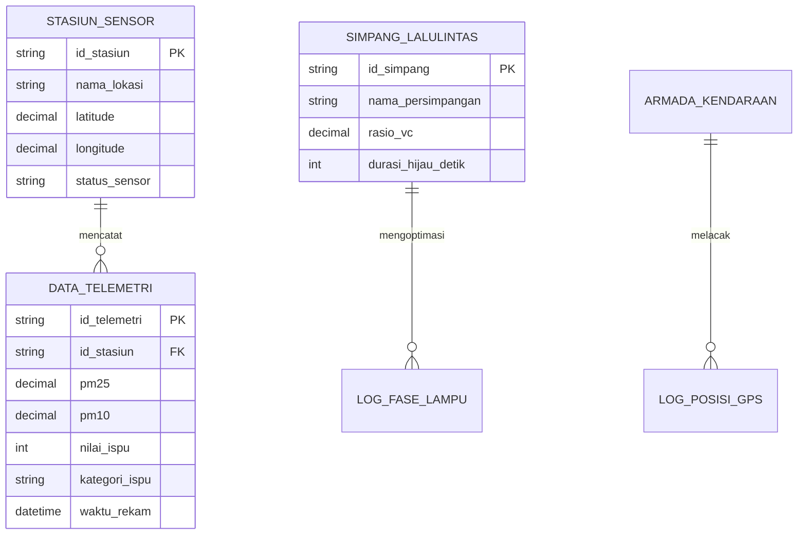

# ARSITEKTUR TELEMETRI & ENTITY RELATIONSHIP DIAGRAM (ERD)
## PROYEK: SMARTCITY ISPU TELEMETRI & SPATIAL GIS
**Disusun Oleh:** `agen_arsitek` (SOP-03)  

---

### 1. Skema ERD Relasional

```mermaid
erDiagram
    STASIUN_SENSOR ||--o{ DATA_TELEMETRI : mencatat
    SIMPANG_LALULINTAS ||--o{ LOG_FASE_LAMPU : mengoptimasi
    ARMADA_KENDARAAN ||--o{ LOG_POSISI_GPS : melacak

    STASIUN_SENSOR {
        string id_stasiun PK
        string nama_lokasi
        decimal latitude
        decimal longitude
        string status_sensor
    }

    DATA_TELEMETRI {
        string id_telemetri PK
        string id_stasiun FK
        decimal pm25
        decimal pm10
        int nilai_ispu
        string kategori_ispu
        datetime waktu_rekam
    }

    SIMPANG_LALULINTAS {
        string id_simpang PK
        string nama_persimpangan
        decimal rasio_vc
        int durasi_hijau_detik
    }
```
