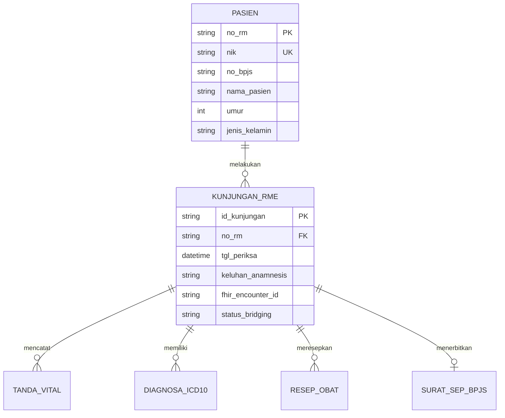

# ARSITEKTUR KESEHATAN & ENTITY RELATIONSHIP DIAGRAM (ERD)
## PROYEK: WIDYAMEDIKA SIMRS & SATUSEHAT FHIR
**Disusun Oleh:** `agen_arsitek` (SOP-03)  

---

### 1. Skema ERD Rekam Medis

```mermaid
erDiagram
    PASIEN ||--o{ KUNJUNGAN_RME : melakukan
    KUNJUNGAN_RME ||--o{ TANDA_VITAL : mencatat
    KUNJUNGAN_RME ||--o{ DIAGNOSA_ICD10 : memiliki
    KUNJUNGAN_RME ||--o{ RESEP_OBAT : meresepkan
    KUNJUNGAN_RME ||--o| SURAT_SEP_BPJS : menerbitkan

    PASIEN {
        string no_rm PK
        string nik UK
        string no_bpjs
        string nama_pasien
        int umur
        string jenis_kelamin
    }

    KUNJUNGAN_RME {
        string id_kunjungan PK
        string no_rm FK
        datetime tgl_periksa
        string keluhan_anamnesis
        string fhir_encounter_id
        string status_bridging
    }
```
