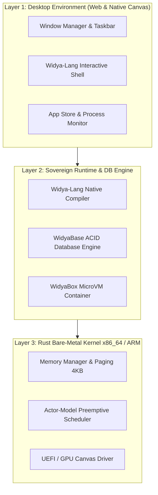

# ARSITEKTUR KERNEL & SISTEM OPERASI BERDAULAT
## PROYEK: WIDYAOS SOVEREIGN DESKTOP
**Disusun Oleh:** `agen_arsitek` (SOP-03) & `agen_devops` (SOP-06)  

---

### 1. Diagram Layering WidyaOS

```mermaid
graph TB
    subgraph UI["Layer 1: Desktop Environment (Web & Native Canvas)"]
        WM[Window Manager & Taskbar]
        REPL[Widya-Lang Interactive Shell]
        Store[App Store & Process Monitor]
    end

    subgraph Runtime["Layer 2: Sovereign Runtime & DB Engine"]
        WLang[Widya-Lang Native Compiler]
        WDB[WidyaBase ACID Database Engine]
        WBox[WidyaBox MicroVM Container]
    end

    subgraph Kernel["Layer 3: Rust Bare-Metal Kernel x86_64 / ARM"]
        MemMgr[Memory Manager & Paging 4KB]
        Scheduler[Actor-Model Preemptive Scheduler]
        Drivers[UEFI / GPU Canvas Driver]
    end

    UI --> Runtime
    Runtime --> Kernel
```
